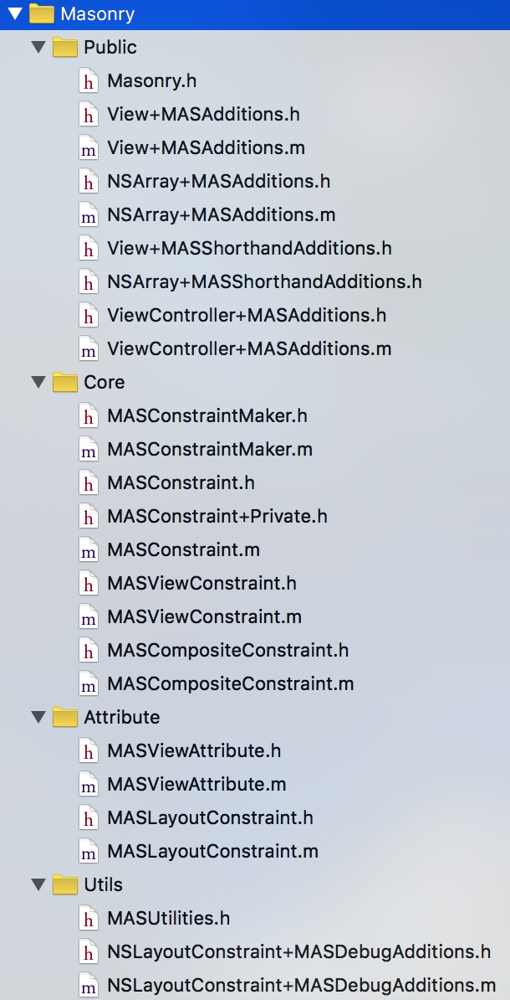

# 世界那么大，我已经看了（一）Masonry 源码

上两周把 Masonry 看了一遍，然后今晚又看了第二遍，主要看了 Core 部分，代码很好看。

# 架构划分

我把 Masonry 的架构大致划分如下：



* **Public**  公开接口，如 make.mas_left, view.mas_width 这些方法。
* **Core**  包括 Constraint 建模和 Constraints Maker.
* **Attribute**  这里放的是约束的一部分属性模型。
* **Utils**  工具，如 Debug 和 Box Value.


# Public

View + MASAdditions, NSArray + MASAdditions, ViewController + MASAdditions 这三个分类提供了 View / View Array / ViewController 的一些属性的存取方法，如 mas_left, mas_topLayoutGuide 等，区分 iOS 和 Mac 平台。

这里的获取 Views 之间的 Common Super View 和 make/update/remake constraints 的区别都是我很喜欢问的问题。

View + MASShorthandAdditions, NSArray + MASShorthandAdditions 这两个分类为以上方法提供了 shorthand 接口，其中用宏来简化代码量的写法很好玩，虽然也很常见。


# Attribute

个人觉得 Masonry 中比较不好的是，类之间的命名有点意义不明，因为太相似了。所以必须首先在概念上区分它们：

## MASAttribute

其实就是 NSLayoutAttribute 这个 enum 的 Masonry NS_OPTIONS 版本，声明如下：

```
typedef NS_OPTIONS(NSInteger, MASAttribute) {
    MASAttributeLeft = 1 << NSLayoutAttributeLeft,
    MASAttributeRight = 1 << NSLayoutAttributeRight,
    MASAttributeTop = 1 << NSLayoutAttributeTop,
    MASAttributeBottom = 1 << NSLayoutAttributeBottom,
    MASAttributeLeading = 1 << NSLayoutAttributeLeading,
    MASAttributeTrailing = 1 << NSLayoutAttributeTrailing,
    MASAttributeWidth = 1 << NSLayoutAttributeWidth,
    MASAttributeHeight = 1 << NSLayoutAttributeHeight,
    MASAttributeCenterX = 1 << NSLayoutAttributeCenterX,
    MASAttributeCenterY = 1 << NSLayoutAttributeCenterY,
    MASAttributeBaseline = 1 << NSLayoutAttributeBaseline,
    
#if TARGET_OS_IPHONE
    
    MASAttributeLeftMargin = 1 << NSLayoutAttributeLeftMargin,
    MASAttributeRightMargin = 1 << NSLayoutAttributeRightMargin,
    MASAttributeTopMargin = 1 << NSLayoutAttributeTopMargin,
    MASAttributeBottomMargin = 1 << NSLayoutAttributeBottomMargin,
    MASAttributeLeadingMargin = 1 << NSLayoutAttributeLeadingMargin,
    MASAttributeTrailingMargin = 1 << NSLayoutAttributeTrailingMargin,
    MASAttributeCenterXWithinMargins = 1 << NSLayoutAttributeCenterXWithinMargins,
    MASAttributeCenterYWithinMargins = 1 << NSLayoutAttributeCenterYWithinMargins,

#endif
    
};
```

## MASViewAttribute

这是一个类，它将 MAS_VIEW (其实就是 UIView / NSView) 和 NSLayoutAttribute 封装在一起了。举一个 Masonry 方程式的例子：

```
make.left.equalTo(secondView.right);
```

注意这里的 secondView.right ，就是一个 MASViewAttribute ，它可以用来描述 View 的属性，如 left, right, bottom, top 等。

## MASLayoutConstraint

这是一个类，它是 NSLayoutConstraint 的子类，唯一多出的是一个 mas_key ，用于 Debug.

其实它是下文要提到的 MASViewConstraint 的一个属性，这个更加容易混淆。


# Utils

## MASUtilities

定义了区分 iOS 和 Mac 的宏，如 MAS_VIEW, MAS_VIEW_CONTROLLER, MASEdgeInsets 等，还有重新定义了 UILayoutPriority.

MASAttachKeys 这个宏把 View 和用于 Debug 的 keys 自动关联起来了，非常便捷。实现必看，核心是 NSDictionaryOfVariableBindings.

最精彩的当然是 MASBoxValue 这个宏：

```
#define MASBoxValue(value) _MASBoxValue(@encode(__typeof__((value))), (value))
```

涉及的知识点有：
* 可变参数读取
* 读取一个 value 的类型
* Box Value: 将基本数据类型如 int, long 等 wrap 成 NSNumber、将结构体如 CGPoint, CGize, MASEdgeInsets 等 wrap 成 NSValue.

## NSLayoutConstraint + MASDebugAdditions

这个 Category 重写了 NSLayoutConstraint 的 description 方法，为 NSLayoutConstraint 加上了开发者绑定的标识 key ，然后把一些 Relation, Attribute, Priority 等字符串化，在调试的时候看起来更加清晰明了。

注意结合上面的 MASAttachKeys 这个宏来用。


# Core

有了上面的积累，最后我们来看 Core 部分。 Core 部分做的工作就是 Make and Install Constraints to View. 

## MASConstraint / MASViewConstraint / MASCompositeConstraint

MASConstraint 是 NSObject 的子类，是一个抽象基类，它的初始化方法加了断言机制，如果该方法被直接调用将会 crash，代码：

```
- (id)init {
	NSAssert(![self isMemberOfClass:[MASConstraint class]], @"MASConstraint is an abstract class, you should not instantiate it directly.");
	return [super init];
}
```

其中很多方法都是需要子类去实现的，如果子类没实现这里会主动抛异常。

MASViewConstraint 是 MASConstraint 的子类，它是单个 NSLayoutConstraint 的封装，通过 MASViewAttribute 来初始化。
MASCompositeConstraint 是 MASConstraint 的子类，它是一组 NSLayoutConstraint 的封装，可以通过一组 MASConstraint 来初始化。

## mas_equalTo 和 mas_offset

下面的宏是由 MASConstraint 来调用的：

```
/**
 *  Convenience auto-boxing macros for MASConstraint methods.
 *
 *  Defining MAS_SHORTHAND_GLOBALS will turn on auto-boxing for default syntax.
 *  A potential drawback of this is that the unprefixed macros will appear in global scope.
 */
#define mas_equalTo(...)                 equalTo(MASBoxValue((__VA_ARGS__)))
#define mas_greaterThanOrEqualTo(...)    greaterThanOrEqualTo(MASBoxValue((__VA_ARGS__)))
#define mas_lessThanOrEqualTo(...)       lessThanOrEqualTo(MASBoxValue((__VA_ARGS__)))

#define mas_offset(...)                  valueOffset(MASBoxValue((__VA_ARGS__)))


#ifdef MAS_SHORTHAND_GLOBALS

#define equalTo(...)                     mas_equalTo(__VA_ARGS__)
#define greaterThanOrEqualTo(...)        mas_greaterThanOrEqualTo(__VA_ARGS__)
#define lessThanOrEqualTo(...)           mas_lessThanOrEqualTo(__VA_ARGS__)

#define offset(...)                      mas_offset(__VA_ARGS__)

#endif


@interface MASConstraint (AutoboxingSupport)

/**
 *  Aliases to corresponding relation methods (for shorthand macros)
 *  Also needed to aid autocompletion
 */
- (MASConstraint * (^)(id attr))mas_equalTo;
- (MASConstraint * (^)(id attr))mas_greaterThanOrEqualTo;
- (MASConstraint * (^)(id attr))mas_lessThanOrEqualTo;

/**
 *  A dummy method to aid autocompletion
 */
- (MASConstraint * (^)(id offset))mas_offset;

@end
```

如果定义了 MAS_SHORTHAND_GLOBALS ，那么调用 equalTo (如 make.left.equalTo(view.right); )调用的是 equalTo(...) 宏，传入参数的可以是 MASViewAttribute, UIView, NSValue, NSArray 等对象，然后调用 mas_equalTo(`__VA_ARGS__`) 这个方法，实现代码如下：

```
- (MASConstraint * (^)(id))equalTo {
    return ^id(id attribute) {
        return self.equalToWithRelation(attribute, NSLayoutRelationEqual);
    };
}
```

这里最终返回的是一个 Block ，Block 中更新当前约束的 attribute 和 relation 并最终返回新的 MASConstraint. 而 equalTo(view.right) 已经调用了这个 Block ，并返回了更新后的 MASConstraint. 链式语法就是这样传递下去的。

如果定义了 MAS_SHORTHAND_GLOBALS 并调用 offset (如 make.left.equalTo(view.right).offset(10); ) 调用的将是 mas_offset(...) ，也就是 valueOffset 方法，所以 MASConstraint 中定义的 mas_offset 方法将永远得不到调用，因为它总是被 mas_offset 这个宏覆盖了，实际调用的是 valueOffset 方法，该方法返回一个 Block ，在 Block 中改变了当前约束的 Layout Constant ，并返回 self ，也是一个 MASConstraint. 而 valueOffset(10) 已经调用了这个 Block ，并返回了更新后的 MASConstraint.

## return type 和链式调用

注意 MASConstraint 的每一个 getter 方法调用返回的都是 (MASConstraint * (^)(...)) ，注意是一个 Block ，在后面加上参数后调用这个 Block 了，Block 的返回值就是更新后的 MASConstraint ，从而让链式调用一直传递下去。

而 with 和 and 内部则是什么都不做。

## MASConstraintDelegate protocol

```
@protocol MASConstraintDelegate <NSObject>

/**
 *	Notifies the delegate when the constraint needs to be replaced with another constraint. For example
 *  A MASViewConstraint may turn into a MASCompositeConstraint when an array is passed to one of the equality blocks
 */
- (void)constraint:(MASConstraint *)constraint shouldBeReplacedWithConstraint:(MASConstraint *)replacementConstraint;

- (MASConstraint *)constraint:(MASConstraint *)constraint addConstraintWithLayoutAttribute:(NSLayoutAttribute)layoutAttribute;

@end
```

当 MASConstraint 调用 attribtue 的时候，就会触发约束的创建或更新，然后通过 MASConstraintDelegate 传递回去给 MASConstraintMaker 的 constraints 数组，并通过 constraint:shouldBeReplacedWithConstraint: 方法更新该约束或通过 constraint:addConstraintWithLayoutAttribute: 方法来添加约束。

## MASViewConstraint 类的 install 方法

最后看看 MASViewConstraint 中比较核心的 install 方法，代码如下：

```
- (void)install {
    if (self.hasBeenInstalled) {
        return;
    }
    
    MAS_VIEW *firstLayoutItem = self.firstViewAttribute.item;
    NSLayoutAttribute firstLayoutAttribute = self.firstViewAttribute.layoutAttribute;
    MAS_VIEW *secondLayoutItem = self.secondViewAttribute.item;
    NSLayoutAttribute secondLayoutAttribute = self.secondViewAttribute.layoutAttribute;

    // alignment attributes must have a secondViewAttribute
    // therefore we assume that is refering to superview
    // eg make.left.equalTo(@10)
    // 如果 secondViewAttribute 为空，则默认为 superview
    if (!self.firstViewAttribute.isSizeAttribute && !self.secondViewAttribute) {
        secondLayoutItem = self.firstViewAttribute.view.superview;
        secondLayoutAttribute = firstLayoutAttribute;
    }
    
#warning - Core Method
    MASLayoutConstraint *layoutConstraint
        = [MASLayoutConstraint constraintWithItem:firstLayoutItem
                                        attribute:firstLayoutAttribute
                                        relatedBy:self.layoutRelation
                                           toItem:secondLayoutItem
                                        attribute:secondLayoutAttribute
                                       multiplier:self.layoutMultiplier
                                         constant:self.layoutConstant];
    
    layoutConstraint.priority = self.layoutPriority;
    layoutConstraint.mas_key = self.mas_key;
    
    // 获取要装配的 view
    if (self.secondViewAttribute.view) {
        MAS_VIEW *closestCommonSuperview = [self.firstViewAttribute.view mas_closestCommonSuperview:self.secondViewAttribute.view];
        NSAssert(closestCommonSuperview,
                 @"couldn't find a common superview for %@ and %@",
                 self.firstViewAttribute.view, self.secondViewAttribute.view);
        self.installedView = closestCommonSuperview;
    } else if (self.firstViewAttribute.isSizeAttribute) {
        self.installedView = self.firstViewAttribute.view;
    } else {
        self.installedView = self.firstViewAttribute.view.superview;
    }


    MASLayoutConstraint *existingConstraint = nil;
    if (self.updateExisting) {
        existingConstraint = [self layoutConstraintSimilarTo:layoutConstraint];
    }
    if (existingConstraint) {
        // just update the constant
        existingConstraint.constant = layoutConstraint.constant;
        self.layoutConstraint = existingConstraint;
    } else {
        [self.installedView addConstraint:layoutConstraint];
        self.layoutConstraint = layoutConstraint;
        [firstLayoutItem.mas_installedConstraints addObject:self];
    }
}
```

其实很简单，就是创建 NSLayoutConstraint ，然后获取要装配约束的 view:

* 如果 secondView 存在则为 firstView 和 secondView 的 closest common super view
* 如果 secondView 不存在且添加的约束是 NSLayoutAttributeWidth / NSLayoutAttributeHeight 这种针对 firstView 自身的，则为 firstView 自身
* 如果 secondView 不存在且添加的约束不是针对 firstView 自身的，则为 firstView 的 super view

接着判断是否约束已存在，存在就直接更新约束的 constant，不存在就把 NSLayoutConstraint 添加到要装配的 view 上。

## MASConstraintMaker

如果上面的都明白了，那这里就很简单了，顾名思义就是制造约束的。

在 make.left.equalTo(xxx); 这种调用中，开头的总是 MASConstraintMaker *make ，而 left/right/top/bottom/... 这些方法调用返回的总是 MASConstraint ，目的很简单，链式调用的连接点都是 MASConstraint 类啊。

MASConstraintMaker 类中有一个数组 `NSMutableArray<__kindof MASConstraint *> *constraints` ，对于每一行 make.xxx.xxx.xxx 这种链式调用最后都是创建一个新的 MASConstraint 并添加到 maker 的 constraints 数组中。

最后我们看一下 MAS_VIEW 的 make/update/remake 的实现代码：

```
- (NSArray *)mas_makeConstraints:(void(^)(MASConstraintMaker *))block {
    self.translatesAutoresizingMaskIntoConstraints = NO;
    MASConstraintMaker *constraintMaker = [[MASConstraintMaker alloc] initWithView:self];
    block(constraintMaker);
    return [constraintMaker install];
}

- (NSArray *)mas_updateConstraints:(void(^)(MASConstraintMaker *))block {
    self.translatesAutoresizingMaskIntoConstraints = NO;
    MASConstraintMaker *constraintMaker = [[MASConstraintMaker alloc] initWithView:self];
    constraintMaker.updateExisting = YES;
    block(constraintMaker);
    return [constraintMaker install];
}

- (NSArray *)mas_remakeConstraints:(void(^)(MASConstraintMaker *make))block {
    self.translatesAutoresizingMaskIntoConstraints = NO;
    MASConstraintMaker *constraintMaker = [[MASConstraintMaker alloc] initWithView:self];
    constraintMaker.removeExisting = YES;
    block(constraintMaker);
    return [constraintMaker install];
}
```

其中 block(constraintMaker) 的内容就是创建了各种关于 self (一个 view) 的约束，例如：

```
make.top.greaterThanOrEqualTo(superview.top).offset(padding);
make.left.equalTo(superview.left).offset(padding);
make.bottom.equalTo(blueView.top).offset(-padding);
make.right.equalTo(redView.left).offset(-padding);
make.width.equalTo(redView.width);

make.height.equalTo(redView.height);
make.height.equalTo(blueView.height);
```

以 make.left 为例，看看发生了什么事：

```
- (MASConstraint *)left {
    return [self addConstraintWithLayoutAttribute:NSLayoutAttributeLeft];
}

- (MASConstraint *)addConstraintWithLayoutAttribute:(NSLayoutAttribute)layoutAttribute {
    return [self constraint:nil addConstraintWithLayoutAttribute:layoutAttribute];
}

- (MASConstraint *)constraint:(MASConstraint *)constraint addConstraintWithLayoutAttribute:(NSLayoutAttribute)layoutAttribute {
    MASViewAttribute *viewAttribute = [[MASViewAttribute alloc] initWithView:self.view layoutAttribute:layoutAttribute];
    MASViewConstraint *newConstraint = [[MASViewConstraint alloc] initWithFirstViewAttribute:viewAttribute];
    if ([constraint isKindOfClass:MASViewConstraint.class]) {
        //replace with composite constraint
        NSArray *children = @[constraint, newConstraint];
        MASCompositeConstraint *compositeConstraint = [[MASCompositeConstraint alloc] initWithChildren:children];
        compositeConstraint.delegate = self;
        [self constraint:constraint shouldBeReplacedWithConstraint:compositeConstraint];
        return compositeConstraint;
    }
    if (!constraint) {
        newConstraint.delegate = self;
        [self.constraints addObject:newConstraint];
    }
    return newConstraint;
}
```

一句话，根据 NSLayoutAttribute 创建对应的 MASConstraint.

然后将其添加到 maker 的 constraints 数组中。最后调用的是 [maker install] 方法，代码如下：

```
- (NSArray *)install {
    // 先移除旧的约束
    if (self.removeExisting) {
        NSArray *installedConstraints = [MASViewConstraint installedConstraintsForView:self.view];
        for (MASConstraint *constraint in installedConstraints) {
            [constraint uninstall];
        }
    }
    // 再添加现有约束，并设置更新标志位
    NSArray *constraints = self.constraints.copy;
    for (MASConstraint *constraint in constraints) {
        constraint.updateExisting = self.updateExisting;
        [constraint install];
    }
    [self.constraints removeAllObjects];
    return constraints;
}
```

其中 remakeConstraints 会将 maker.view 的所有已安装约束先移除。然后遍历 constraints 数组中的 MASConstraint 元素，如果是 updateConstraints 还要设置约束的 updateExisting 标志位，如果是 makeConstraints 则直接 install 对应的约束，详细代码见上文中 MASViewConstraint 的 install 方法。


# 小结

最后请告诉我：

1.下面的代码背后发生了什么事？

```
[view1 makeConstraints:^(MASConstraintMaker *make) {
	make.left.equalTo(view2.left).offset(10);
	make.width.equalTo(100);
	...
}];
```

2.Masonry 的链式调用是怎么做到的？
