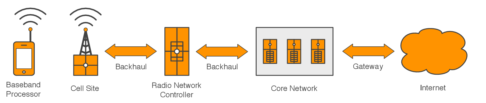
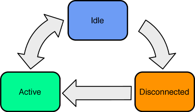
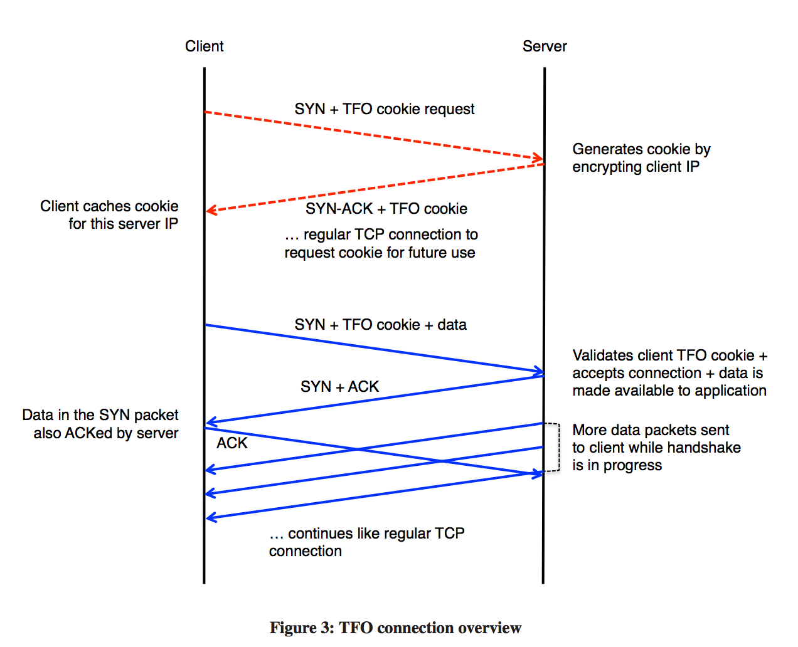

# Secrets of Mobile Network Performance Reading Notes

[Secrets of Mobile Network Performance](http://aosabook.org/en/posa/secrets-of-mobile-network-performance.html) 主要探究了手机网络的性能瓶颈在哪里以及如何优化。

## 文章结构

* Introduction
* What Are You Waiting For?
* Mobile Cellular Networks
	* Baseband Processor
	* Cell Site
	* Backhaul Network
	* Radio Network Controller
	* Core Network
	* Power Conservation
		* Active
		* Idle
		* Disconnected
* Network Protocol Performance
	* Transmission Control Protocol
		* TCP Fast Open
		* Initial Congestion Window
	* Hypertext Transport Protocol
		* Keepalive
	* Transport Layer Security
		* Refresh on Failure
		* Asynchronous Refresh
* Conclusion

## Introduction

文章开头就说明了手机网络的性能瓶颈在于 `Latency`（延时），在逻辑上分为两个部分，第一部分探索网络延时在 `Mobile Cellular Network` 中是如何产生的，第二部分介绍了一些减小网络延时的软件技术。

## What Are You Wating For?

是什么造成了网络延时？可以用 `Round-trip time (RTT)` 来测量，`RTT` 就是一个请求从请求方发送到接收方，响应再从接收方返回给接收方的整个过程的时间，就好像 A 和 B 打乒乓球，乒乓球从 A 到 B 再从 B 到 A 的整个过程的时间。

假设 10KB 数据从 C 到 S 要交换 4 次消息，也就是 4 个来回，每个来回的时间是 100ms ，最后算得的吞吐量是 25KB/s ，如果只需要一次消息交换，那吞吐量就是 100KB/s 。无论带宽多高，如果消息交换的次数太多，吞吐量还是会变低。解决方案很明显：尽量避免 `client` 和 `server` 之间的 `round-trip message exchange`.

## Mobile Cellular Networks

这一章说的是手机蜂窝网络的组成和工作原理，并从中分析性能瓶颈所在。

如图，主要包括 5 个部分。

第一个部分是手机内嵌的 `Baseband Processor` ，该组件用于实现所有无线网络功能，类似于使用无线电波的电脑 `modem`. 而它处理网络任务需要固定时长，但是都在微秒级别，在网络延时组成中可以忽略不计。

第二个部分是 `Cell Site` ，用于接收手机的无线电波，是手机网络的入口。它负责处理特定的网络任务，最新一代组件还负责管理手机设备的任务，如 `network registration or transmission scheduling`（之前是由 `Radio Network Controller` 负责）。这里的任务处理时间也是微秒级别，在网络延时中可以忽略不计。

第三个部分是 `Backhaul Network` （回程线路网络），用于连接 `Cell Site`， `Radiow Network Controller` 和 `Core Network` ，由于电路交换网络、旧式网络使用的同步等待协议、物理基础设施的带宽限制等，这里会产生非常严重的网络延时，是网络延时的核心组成。

第四个部分是 `Radio Network Controller` ，管理 `Cell Site` 和手机，由于数据要到达它需要经过 `Backhaul Network` ，会造成较大延时，所以如果某些任务需要来回的，就尽量挪到 `Cell Site` 去做。

第五个部分是 `Core Network` ，这里是因特网的入口，起到类似网关的作用，在这里运营商会做类似流量计费的工作，因此需要拦截流量进行分析，但是这里的拦截分析时间在网络延时中也是可以忽略不计的。

随后说了一下 `Power Conservation` 的机制，见下图。

手机在收发数据的时候是最耗电的，此时处于 `Active` 状态，在收发数据完毕一定时间后进入 `Idle` 状态，此时网络连接可以随时恢复，当空闲状态一定时间后切换回 `Disconnected ` 状态，目的是为了节约电量，而从 `Disconnected` 状态切换到 `Active` 状态需要花费数百毫秒，也是延时的一部分。

## Network Protocol Performance

以上部分对于我们软件开发者来说都是不可控制的，接下来回到我们可以控制的部分，也就是网络协议的性能分析和优化。主要介绍了 `TCP`，`HTTP`，`TLS` 和 `DNS` 等网络协议对避免 `Round-trip` 的优化。

### TCP

作者对 `TCP` 的优化先介绍了 `TFO(TCP Fast Open)`，`TFO` 是对 `TCP` 的扩展，由 `Google` 开发，目前还是 `RFC` 的草案，还没形成正式标准。其思路是在三次握手过程中携带要传输的数据，即使此时 `TCP` 连接还没有正式建立 ，如下图：

在第一次建立 `TCP` 连接或 `TFO Cookie` 超时时，客户端会和服务端正常三次握手建立连接，并且客户端会拿到服务端生成的 `TFO Cookie` ，用于后续的身份认证。随后，如果客户端要和服务端建立 `TCP` 连接，可以在 `SYN` 报文中携带数据，不过要加上 `TFO Cookie` ，这就避免了恶意攻击。

对于重复的 `SYN` + `data`，TFO选择接受重复，它的观点是可以忍受幂等的请求（例如 `GET`），并交给上层的应用程序去处理。

之后介绍了 `TCP拥塞控制` ，包括拥塞窗口 `Congestion Window` 和慢启动等机制，避免拥塞的网络性能进一步恶化。

### HTTP

作者对 `HTTP` 的优化介绍了 `Keepalive` 机制，让多个HTTP连接复用同一条TCP连接收发数据，从而避免多个 `TCP三次握手` 带来的 `Round-trip` 耗时.

### TLS

`TLS` 的握手需要两次数据交换（两个 `Round-trip` ），所以对比起 `HTTP` ， `HTTPS` 会更慢。

### DNS Cache

为了避免频繁的 `DNS查询` ，系统都会提供 `DNS Cache` 的功能，在 `DNS Cache` 中每条记录都会有生存时间限制（`TTL`），少的几秒多的几天，`TTL` 较小的记录通常用于缓解服务器故障或者负载均衡等用途。由于系统自身的 `DNS Cache` 的存在，避免了对 `DNS服务器` 的网络请求，所以避免或减少了不必要的网络查询。

`Refresh on Failure` 是减小服务器故障时间和保障客户端性能之间的平衡点。由于 `TTL` 较小的记录通常用于服务器故障时的解析，所以如果严格遵循 `DNS Cache` 规则，这些记录将频繁被清除，并引发客户端进行频繁的DNS网络查询，为了避免这样的情况，这里可以仅在 `TCP` 和 `HTTP` 等高层协议遇到没有覆盖到的错误才进行刷新。

`Asynchronous Refresh` 顾名思义就是异步刷新，对于超时的 `DNS Cache` 记录，在后台发起异步的DNS网络查询并刷新 `DNS Cache`，这样就避免了在需要使用到该DNS记录时才去同步查询带来的延时。

## Conclusion

要提高手机网络性能，就要避免网络延时，最主要的思路就是避免或减少多次消息交换（`Round-trip`），而软件设计人员需要在网络协议中寻求突破。
