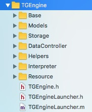
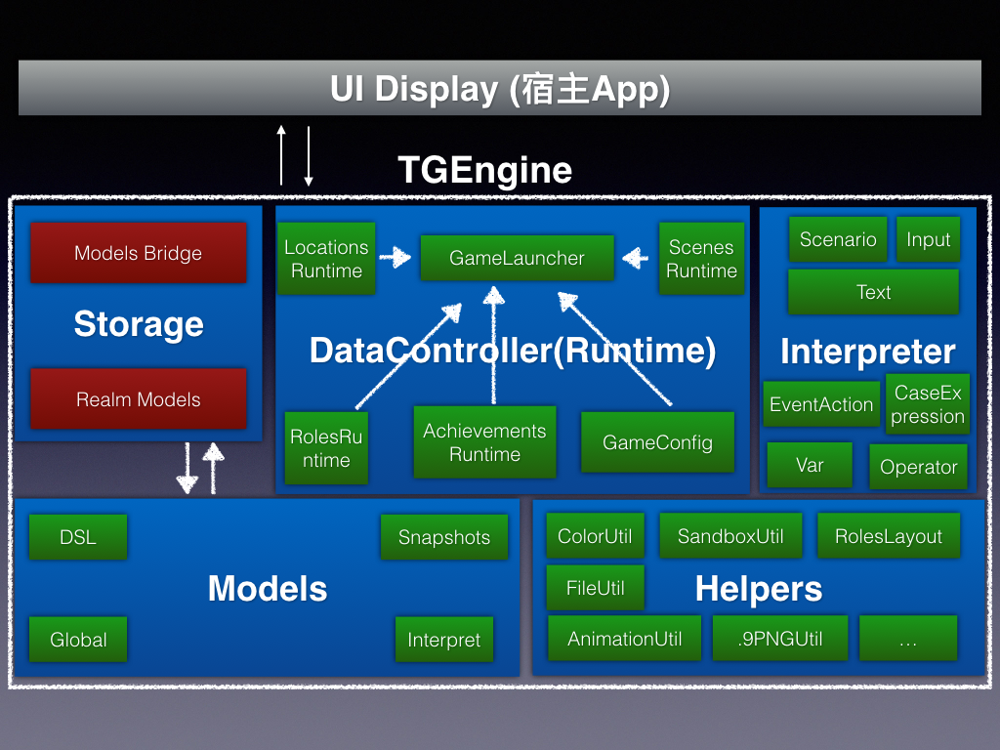
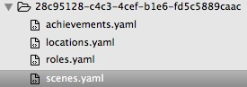
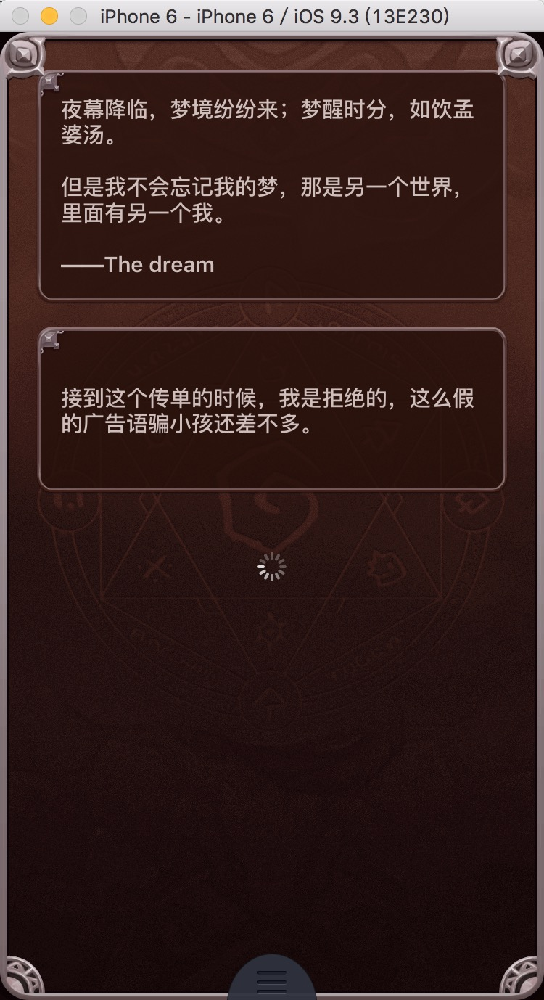
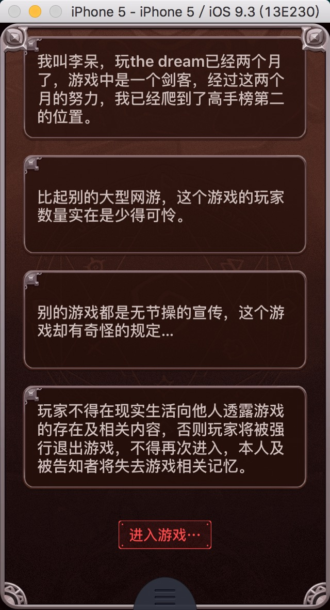
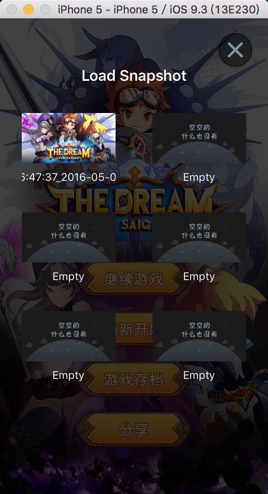

# 赛高文字游戏解析引擎实现

## 一、结构组成

**TGEngine** 的工程目录结构如下：



其中：

* Base 存放 TGEngine 共用的头文件
* Models 存放游戏内容的相关 Model ，分为 DSL, Snapshots, Global, Interpret 等四部分
* Storage 包括 RLMModels 和 DataManager 两部分，前者存放 Raw Model 对应的 Realm Model，后者存放 Models 的桥接类
* DataController 存放游戏运行时的管理类
* Helpers 存放各种提供基本功能的工具类
* Interpreter 存放游戏章节和文字内容的解析器
* Resource 存放资源文件，例如语言本地化的 bundle

**TGEngine** 的逻辑结构如下：



缺陷：目前缺少一个统一的上层接口层，暴露了引擎内部过多的实现细节。

## 二、实现思路

首先用 DSL(Domain-Specific Languages) 写剧本，开始是想自己定制一门语言，不过维护成本过高，最后决定使用 YAML(YAML Ain't a Markup Language).

写好剧本之后，考虑到 OC 解析 YAML 的开源框架极少且不成熟，所以用 Python 脚本将 YAML 转换为 JSON ，再由 **TGEngine** 将 JSON 转换为 Model 建模解析。

剧本分为多个章节，多个章节之间相互连接，最终形成一棵树。 **TGEngine** 负责解析并持有这棵树。UI如何展示由宿主 App 决定。

接下来从底层到高层说下实现过程。

## 三、建模: YAML -> JSON -> Models

一个游戏将包括以下脚本：



以 scenes.yaml 的一部分为例：

```
scenes:
  - id: S001
    location: 
    scenario: 
      goto: S002
      dialogs:
        - saying:
          all_roles:
          duration:
          content: "夜幕降临，梦境纷纷来；梦醒时分，如饮孟婆汤。\n\n但是我不会忘记我的梦，那是另一个世界，里面有另一个我。\n\n——The dream"
        - saying: 
          all_roles:
          duration:
          content: 接到这个传单的时候，我是拒绝的，这么假的广告语骗小孩还差不多。
        - saying:
          all_roles:
          duration:
          content: 但是我失业了，成夜的盯着天花板，天花板里似乎都要生出妖魔鬼怪来。
        - saying: 
          all_roles:
          duration:
          content: 百无聊赖的我在手机里安装了这个叫“The dream”的游戏，不说别的，至少当晚，我睡着了。
        - saying: 
          all_roles:
          duration:
          content: 我叫李呆，玩the dream已经两个月了，游戏中是一个剑客，经过这两个月的努力，我已经爬到了高手榜第二的位置。
        - saying: 
          all_roles:
          duration:
          content: 比起别的大型网游，这个游戏的玩家数量实在是少得可怜。
        - saying: 
          all_roles:
          duration:
          content: 别的游戏都是无节操的宣传，这个游戏却有奇怪的规定…
        - saying: 
          all_roles:
          duration:
          content: 玩家不得在现实生活向他人透露游戏的存在及相关内容，否则玩家将被强行退出游戏，不得再次进入，本人及被告知者将失去游戏相关记忆。
    question:
    condition:
  - id: S002
    location: 
    scenario: 
      goto: S997
      dialogs:
        - saying:
          all_roles:
          duration: 60
          content: 进入游戏···
    question:
    condition:
  - id: S997
    location: 
    scenario: 
      goto: S1001
      dialogs:
        - saying:
          all_roles:
          duration:
          content: 系统：“欢迎您回到游戏，请先领取今日大礼包。”
    question:
    condition:
```

其中每个元素代表一个章节，章节由 id 标识，goto 表示下一个章节的 id，通过这种方式将章节之间连接起来。

在作者写好剧本后（目前包括产品经理手写和开发中的剧本编辑工具两种方式），将 YAML 转换为 JSON ，然后 **TGEngine** 通过 **YYModel** 这种轻量无侵入的 JSON to Model 框架将 JSON 转换为对应的 Model ，以一个章节（或者说是场景）对应的 TGESceneModel 为例：

```
// TGESceneModel.h

#import "TGEBaseModel.h"
#import "TGEScenarioModel.h"
#import "TGEQuestionModel.h"
#import "TGEConditionModel.h"
#import "TGEInputModel.h"
#import "TGEMonitorModel.h"

NS_ASSUME_NONNULL_BEGIN

@interface TGESceneModel : TGEBaseModel

@property (nonatomic, copy) NSString *objectID;
@property (nonatomic, copy, nullable) NSString *locationID;
@property (nonatomic, strong, nullable) TGEScenarioModel *scenario;
@property (nonatomic, strong, nullable) TGEQuestionModel *question;
@property (nonatomic, strong, nullable) TGEConditionModel *condition;
@property (nonatomic, strong, nullable) TGEInputModel *input;
@property (nonatomic, strong, nullable) TGEMonitorModel *monitor;

@end

NS_ASSUME_NONNULL_END

// TGESceneModel.m

#import "TGESceneModel.h"
#import "TGEMacros.h"

@implementation TGESceneModel

+ (NSDictionary *)modelCustomPropertyMapper {
    return @{
        @"objectID"     : @"id",
        @"locationID"   : @"location",
        @"scenario"     : @"scenario",
        @"question"     : @"question",
        @"condition"    : @"condition",
        @"input"        : @"entry",
        @"monitor"      : @"monitor"
    };
}

TGEBaseModel_YYModel_NSCoding_NSCopying_Equal

@end
```

目前场景包括 Scenario, Question, Condition, Entry, Monitor 等五类，分别代表普通对话、问题和答案、条件判断、玩家输入、Action执行等。而游戏引擎主要做的就是解析这五种场景并呈现数据给宿主 App。

至此DSL建模完成。

## 四、Helpers

对于 **TGEngine** ，为了尽量避免引入第三方类库，一些基本的工具类在此引入，对于一些必要的第三方类库，通过手动添加来加入，为了避免冲突尽量把前缀都改成 TGE，避免使用 CocoaPods 来安装（宿主 App 可以），目前使用到的第三方类库包括：YYModel, Realm, EDColor.

比较重要的几个类：

**TGEModelsParser** 负责读取 json 文件并通过 YYModel 转换为 Models，主要代码如下：

```
#define _TGE_modelsFrom(_key_, _modelClass_)    \
    if (filePath == nil) return nil;                                                        \
    NSURL *fileURL = [NSURL fileURLWithPath:filePath];                                      \
    NSData *jsonData = [[NSData alloc] initWithContentsOfURL:fileURL];                      \
    if (jsonData == nil) return nil;                                                        \
    NSDictionary *rootDict = [NSJSONSerialization JSONObjectWithData:jsonData options:0 error:nil]; \
    NSArray *jsonObjArr = rootDict[_key_];                                                  \
    NSMutableArray *modelsArr = [NSMutableArray arrayWithCapacity:jsonObjArr.count];        \
    for (NSUInteger i = 0; i < jsonObjArr.count; i++) {                                     \
        NSDictionary *subdict = jsonObjArr[i];                                              \
        TGEGameModel *mod = [_modelClass_ yy_modelWithDictionary:subdict];                  \
        [modelsArr addObject:mod];                                                          \
    }                                                                                       \
    return [modelsArr copy];
```

**TGEFileManager** 负责对 Sandbox 中的文件进行操作，包括获取目录、新建目录、复制移动删除文件、存取可序列化的数据等。目前正投入生产环境实践中，还需要经受时间和用户量的考验。

**TGENinePatchImageParser** 负责读取点9图，由于文字解析引擎追求的是 iOS 和 Android 使用同一套图片素材，而 Android 的点9图能够很好地达到素材拉伸不变形的效果，所以后期 **TGEngine for iOS** 也加入了对点9图读取的支持。代码主要参考自 [shiami/SWNinePatchImageFactory](https://github.com/shiami/SWNinePatchImageFactory) ，注意源代码对2倍点9图的支持有问题，已经有开发者发了解决了的 PR 但是作者没合并，该库已经2年没有维护过了，需要我们自己进行改造。注：代码修改后，读取三倍的点9图也是成功的。




**TGESandboxHelper** 提供了 **TGEngine** 的目录结构的路径获取方法。例如：

```
+ (NSString *)root_src_gameFolderPathWithGameID:(NSString *)gameID;
+ (NSString *)root_src_gameID_configFilePathWithGameID:(NSString *)gameID;
+ (NSString *)root_src_gameID_imageFolderPathWithGameID:(NSString *)gameID;
+ (NSString *)root_src_gameID_scriptFolderPathWithGameID:(NSString *)gameID;
+ (NSString *)root_src_gameID_configFolderPathWithGameID:(NSString *)gameID;
+ (NSString *)root_src_gameID_musicFolderPathWithGameID:(NSString *)gameID;
+ (NSString *)root_src_gameID_tmpFolderPathWithGameID:(NSString *)gameID;
```

**TGEGameResourceBuilder** 负责解压游戏资源对应的 zip 文件，并在 Sandbox 中建立该游戏的相关目录，主要代码如下：

```
+ (void)buildGameResourceWithGame:(TGEGameModel *)game {
    if (game == nil || [TGEGlobalUtil isStringEmpty:game.objectID]) {
        return;
    }
    
    /* 1. 新建目录，如果必要 */
    [TGESandboxHelper buildSubSandbox_root_src_gameWithGameID:game.objectID];
    
    /* 2. 获取资源并解压（如果有） */
    NSString *zipFilePath = [[mTGEFileManager documentsPath] stringByAppendingPathComponent:[NSString stringWithFormat:@"%@.zip", game.objectID]];
    if ([mTGEFileManager fileExistsAtPath:zipFilePath] == NO) {
        return;
    }
    
    NSString *tmpPath = [TGESandboxHelper root_src_gameID_tmpFolderPathWithGameID:game.objectID];
    // 解压 zip 到 Documents/TGEngine/src/[game_id]/tmp 目录下
    BOOL unzipSucc = [SSZipArchive unzipFileAtPath:zipFilePath toDestination:tmpPath];
    if (unzipSucc == NO) {
        TGELog(@"unzip fail");
        [mTGEFileManager removeItemAtPath:zipFilePath];
        return;
    }
    
    /* 3. 遍历解压后的目录内容，逐个移动到游戏的工作目录 */
    NSString *workspacePath = [TGESandboxHelper root_src_gameFolderPathWithGameID:game.objectID];
    NSString *tmpGamePath = [tmpPath stringByAppendingPathComponent:game.objectID];
    [mTGEFileManager recursiveMoveItemsFromPath:tmpGamePath toPath:workspacePath override:YES];
    
    /* 4. 保存游戏信息到游戏空间中 */
    NSData *data = [NSKeyedArchiver archivedDataWithRootObject:game];
    BOOL saveGameInfoSucc = [mTGEFileManager saveData:data toFilePath:[TGESandboxHelper root_src_gameID_configFilePathWithGameID:game.objectID]];
    if (saveGameInfoSucc == NO) {
        DDLogError(@"保存游戏信息失败, game id = %@", game.objectID);
    }
    
    /* 5. 清除临时资源 */
    [mTGEFileManager removeItemAtPath:tmpPath];
    [mTGEFileManager removeItemAtPath:zipFilePath];
}
```

zip 文件解压后的目录结构：

```
|—— config
|	|—— skin.json
|—— img
|	|—— xxx.png
|	|—— ...
|—— script
|	|—— scenes.json
|	|—— roles.json
|	|—— locations.json
|	|—— achievements.json
```

## 五、游戏的运行时状态

这部分包括：TGEGameLauncher, TGELocationsRuntime, TGERolesRuntime, TGEAchievementsRuntime, TGEScenesRuntime, TGEGameConfig 等类。

下面介绍下这几个类做的工作。

### 5.1 TGEGameLauncher

负责启动和终止游戏、管理游戏的状态如休眠和苏醒，对运行时读到的图片的缓存（作用在UI优化部分会提到，放在这里好像不太合适，需要移到别的地方），持有 Scenes/Roles/Locations/Achievements Runtime 和当前游戏配置等对象。

目前游戏主要有4种状态：

```
typedef NS_ENUM(NSUInteger, TGEGameState) {
    TGEGameStateLaunched,   // 初始化完成
    TGEGameStateRunning,    // 运行中
    TGEGameStateSleeping,   // 睡眠中
    TGEGameStateTerminate,  // 已终止
};
```

主要看看载入游戏的代码：

```
/** 载入游戏（未运行） */
- (TGEGameModel *)launchGame:(TGEGameModel *)game {
    if (game == nil) {
        return nil;
    }
    
    // 避免重复启动游戏
    if ([_runningGameModel.objectID isEqualToString:game.objectID] &&
        _runningGameState == TGEGameStateLaunched)
    {
        return nil;
    }
    
    [self resetProperties];
    
    [TGEGameResourceBuilder buildGameResourceWithGame:game];
    self.runningGameModel = game;
    self.runningGameState = TGEGameStateLaunched;
    
    self.locationsRuntime = [[TGELocationsRuntime alloc] initWithRunningGame:_runningGameModel];
    self.rolesRuntime = [[TGERolesRuntime alloc] initWithRunningGame:_runningGameModel];
    self.achievementsRuntime = [[TGEAchievementsRuntime alloc] initWithRunningGame:_runningGameModel];
    self.scenesRuntime = [[TGEScenesRuntime alloc] initWithRunningGame:_runningGameModel];
    self.runningGameConfig = [[TGEGameConfig alloc] initWithRunningGame:_runningGameModel];
    
    return _runningGameModel;
}
```

关于游戏的睡眠和复苏的逻辑较为复杂，需要考虑较多的情况，在此略过。以后有机会再分享。接下来是几个 Runtime 和游戏配置。

### 5.2 TGELocationsRuntime / TGERolesRuntime / TGEScenesRuntime

每个章节（Scene）都对应一个地点，而地点的剧本由 locations.yaml 描述，TGELocationsRuntime 负责在运行时持有这些 locations ，代码如下：

```
// TGELocationsRuntime.h

#import <Foundation/Foundation.h>

NS_ASSUME_NONNULL_BEGIN

@class TGEGameModel;
@class TGELocationModel;

@interface TGELocationsRuntime : NSObject

- (instancetype)initWithRunningGame:(TGEGameModel *)gameModel NS_DESIGNATED_INITIALIZER;
- (nullable TGELocationModel *)locationForID:(NSString *)locationID;

@end

NS_ASSUME_NONNULL_END

// TGELocationsRuntime.m

#import "TGELocationsRuntime.h"
#import "TGELocationModel.h"
#import "TGEGameModel.h"

#import "TGEModelsParser.h"
#import "TGESandboxHelper.h"


///////////////////////////////////////////////////////////////////////////////////////////


@interface TGELocationsRuntime ()

@property (nonatomic, copy) NSArray<TGELocationModel *> *allRunningLocationModels;
@property (nonatomic, strong) NSMutableDictionary<NSString *, TGELocationModel *> *allLocationsInfo;

@end

@implementation TGELocationsRuntime


///////////////////////////////////////////////////////////////////////////////////////////


#pragma mark - Init

- (instancetype)init {
    return [self initWithRunningGame:[TGEGameModel new]];
}

- (instancetype)initWithRunningGame:(TGEGameModel *)gameModel {
    if (gameModel == nil) {
        return nil;
    }
    
    self = [super init];
    if (self) {
        NSArray *locations = [TGEModelsParser locationModelFromFilePath:[TGESandboxHelper root_src_gameID_script_locationsDefaultFilePathWithGameID:gameModel.objectID]];
        _allRunningLocationModels = [locations copy];
        
        _allLocationsInfo = [NSMutableDictionary dictionaryWithCapacity:_allRunningLocationModels.count];
        [_allRunningLocationModels enumerateObjectsUsingBlock:^(TGELocationModel * _Nonnull obj, NSUInteger idx, BOOL * _Nonnull stop) {
            if (obj.objectID) {
                _allLocationsInfo[obj.objectID] = obj;
            }
        }];
    }
    return self;
}

#pragma mark - Location Accessors

- (TGELocationModel *)locationForID:(NSString *)locationID {
    return _allLocationsInfo[locationID];
}

@end
```

在初始化的时候遍历 allRunningLocationModels 并建立类似索引的字典 allLocationsInfo ，从而在后面查询 locationForID: 时快速获取。

TGERolesRuntime 记录了所有角色的运行时状态，原理和 TGELocationsRuntime 类似，不过多了一个选择主角的接口。

TGEScenesRuntime 记录了所有场景的运行时状态，原理同上。

### 5.3 TGEAchievementsRuntime

成就系统的运行时，成就系统的状态是独立于游戏存档而全局存在的，目前还没成形，在此略过。

### 5.4 TGEGameConfig

目前支持的游戏包括多场景切换（类似橙光游戏）类型和生命线类型两种，这里仅讨论生命线类型的游戏。

对于生命线类型的游戏，不同的剧本有不同的 UI ，例如某种类型的 Cell 的背景图片，文字的字体和颜色等都会有所不同，为此需要加入换肤功能。

皮肤由 [game_id]/config/skin.json 文件配置，示例：

```
  dialog_skin": {
    "background": "pic_timeline_default_dialogbox",
    "text_size": 15,
    "text_color": "#cfbfbc"
  }
```

这个配置的意思是 dialog 类型的 TableViewCell 的背景图片名为 pic_timeline_default_dialogbox ，文字大小为 15 ，文字颜色为 #cfbfbc .



TGEGameConfig 类负责读取这个 json 文件并用一个字典来存储这些配置项，以及提供这些配置值的获取方法。主要代码如下：

```
#pragma mark - Setup

- (instancetype)initWithRunningGame:(TGEGameModel *)game {
    self = [super init];
    if (self) {
        _runningGameModel = game;
        [self loadSkinConfig];
    }
    return self;
}

- (BOOL)loadSkinConfig {
    if (_runningGameModel == nil) {
        return NO;
    }
    if ([TGEGlobalUtil isStringEmpty:_runningGameModel.objectID]) {
        return NO;
    }
    
    NSError *jsonError;
    NSString *jsonFilePath = [TGESandboxHelper root_src_gameID_config_skinDefaultFilePathWithGameID:_runningGameModel.objectID];
    NSData *jsonData = [NSData dataWithContentsOfFile:jsonFilePath];
    self.skinConfigDict = [NSJSONSerialization JSONObjectWithData:jsonData
                                                          options:NSJSONReadingAllowFragments
                                                            error:&jsonError];
    if (jsonError) {
        DDLogError(@"load skin config json error = %@", jsonError);
        return NO;
    }
    
    if (_skinConfigDict) {
        [self preloadSkinImagesFromSandbox];
        return YES;
    }
    else {
        return NO;
    }
}

- (void)preloadSkinImagesFromSandbox {
    [mTGEGameLauncher imageInGameSubSandboxWithName:[self timeline_dialogbox_imageName]];
    [mTGEGameLauncher imageInGameSubSandboxWithName:[self timeline_input_imageName]];
    [mTGEGameLauncher imageInGameSubSandboxWithName:[self timeline_sleeping_imageName]];
    [mTGEGameLauncher imageInGameSubSandboxWithName:[self timeline_animating_imageName]];
    [mTGEGameLauncher imageInGameSubSandboxWithName:[self timeline_option_imageName]];
    [mTGEGameLauncher imageInGameSubSandboxWithName:[self timeline_option_selected_imageName]];
    [mTGEGameLauncher imageInGameSubSandboxWithName:[self timeline_option_highlight_imageName]];
    [mTGEGameLauncher imageInGameSubSandboxWithName:[self timeline_option_disable_imageName]];
    [mTGEGameLauncher imageInGameSubSandboxWithName:[self timeline_endHeaderTop_imageName]];
    [mTGEGameLauncher imageInGameSubSandboxWithName:[self timeline_endHeaderBottom_imageName]];
    [mTGEGameLauncher imageInGameSubSandboxWithName:[self timeline_endContent_imageName]];
}


///////////////////////////////////////////////////////////////////////////////////////////


#pragma mark - Timeline Skin

/** Dialog Skin */

- (NSString *)timeline_dialogbox_imageName {
    NSString *dialogBG = _skinConfigDict[kTGESkin_dialogSkin][kTGESkin_background];
    if ([TGEGlobalUtil isStringEmpty:dialogBG]) {
        return @"pic_timeline_dialogbox";
    }
    else {
        return dialogBG;
    }
}

- (CGFloat)timeline_dialogbox_fontSize {
    NSNumber *textSize = _skinConfigDict[kTGESkin_dialogSkin][kTGESkin_textSize];
    if (textSize == nil) {
        return 13.0f;
    }
    else {
        return textSize.doubleValue;
    }
}

- (UIColor *)timeline_dialogbox_textColor {
    NSString *hexString = _skinConfigDict[kTGESkin_dialogSkin][kTGESkin_textColor];
    return [UIColor colorWithHexString:hexString] ?: [UIColor whiteColor];
}
```

目前这部分代码写得很挫，没有抽象出统一的配置项，大家先将就着看下。另外这里有个 preloadSkinImagesFromSandbox 的方法，作用会在UI优化部分说明。


## 六、数据存储

随着引擎的不断开发，我们开始有了游戏进度读写的需求，如下：



至此开始加入数据存储的功能，主要包括 TGEStorage, RLMModels, TGERLMModelsBridge 三部分，其中 TGEStorage 对外提供 game model, game snapshots(游戏存档), achievement list(成就列表) 等的存取接口。具体的存储逻辑我们使用了 [Realm](https://realm.io/) 做支持，由于 Realm 的 Model 是侵入式的，我们不想改造现有的 Models（下文简称 Raw Models），所以这里另外建立了一套 Realm Model ，并通过 TGERLMModelsBridge 进行 Raw Model 和 Realm Model 之间的转换。

### 6.1 RLMModels

以 TGERLMAchievementModel 为例：

```
// TGERLMAchievementModel.h

#import <Realm/Realm.h>

@interface TGERLMAchievementModel : RLMObject

@property NSString *objectID;
@property NSString *name;
@property NSString *desc;
@property NSString *img_dialog;
@property NSString *img_banner;
@property NSString *img_detail;
@property NSNumber<RLMInt> *when;
@property NSString *caseExpression;
@property NSNumber<RLMBool> *obtained;

@end

RLM_ARRAY_TYPE(TGERLMAchievementModel)


// TGERLMAchievementModel.m

#import "TGERLMAchievementModel.h"

@implementation TGERLMAchievementModel

#pragma mark - Realm Methods

+ (NSArray *)requiredProperties {
    return @[@"objectID", @"name", @"obtained"];
}

//+ (NSString *)primaryKey {
//    return @"objectID";
//}

//+ (NSDictionary *)defaultPropertyValues {
//    return @{};
//}

+ (NSArray *)indexedProperties {
    return @[@"objectID"];
}

//+ (NSArray *)ignoredProperties {
//    return @[];
//}

@end
```

目前 Realm 是0.97.0版本，建模的要点：

1. 属性必须和 Raw Model 一一对应
2. 对于基本数据类型如 Int, Bool ，可以用 NSNumber<RLMInt>, NSNumber<RLMBool> 封装成是否可空的对象
3. 对于 requiredProperties 要特别谨慎，如果存储了 nil 到 requiredProperties ，将会导致崩溃
4. RLMObject 的子类不能是 requiredProperties
5. 不需要指定 primaryKey
6. 吐槽1：数组的写法特别麻烦，需要用 RLMArray，例如：@property RLMArray<TGERLMPropertyModel *><TGERLMPropertyModel> *properties; 而且 TGERLMPropertyModel 必须声明为 RLM_ARRAY_TYPE(TGERLMPropertyModel)
7. 吐槽2：数组还不支持原生对象，一个简单的 @property NSArray<NSString *> *screenshots; 非得写成 @property RLMArray<TGERLMString *><TGERLMString> *screenshots; ，Realm 的作者说后续会做支持

### 6.2 TGERLMModelsBridge

为了逻辑清晰，我把这部分拆分成了 Bunch, DSL, GameSnapshot, Global 等四个 Category ，分别对不同类型的 Model 进行转换。

最终的转换代码示例如下：

单个 TGERoleModel <==> TGERLMRoleModel

```
// TGERLMModelsBridge+DSL.m

+ (TGERLMRoleModel *)singleRealmRoleModelFromRawModel:(TGERoleModel *)roleModel {
    _TGERLM_checkModelValid_(roleModel, [TGERoleModel class])
    TGERLMRoleModel *rlmModel = [[TGERLMRoleModel alloc] init];
    rlmModel.objectID = roleModel.objectID ?: kTGERLMRealmModelDefaultObjectID;
    rlmModel.name = roleModel.name ?: kTGERLMRealmModelPlaceholder;
    rlmModel.desc = roleModel.desc;
    rlmModel.portrait = roleModel.portrait;
    rlmModel.properties = (RLMArray<TGERLMPropertyModel *><TGERLMPropertyModel> *)[self bunchRealmModelsWithRLMClassName:[TGERLMPropertyModel className] fromRawModels:roleModel.properties];
    return rlmModel;
}

+ (TGERoleModel *)singleRoleModelFromRealmRoleModel:(TGERLMRoleModel *)rlmModel {
    _TGERLM_checkModelValid_(rlmModel, [TGERLMRoleModel class])
    TGERoleModel *rawModel = [TGERoleModel new];
    rawModel.objectID = rlmModel.objectID;
    rawModel.name = rlmModel.name;
    rawModel.desc = rlmModel.desc;
    rawModel.portrait = rlmModel.portrait;
    rawModel.properties = [self bunchRawModelsWithRawClass:[TGEPropertyModel class] fromRealmModels:rlmModel.properties];
    return rawModel;
}
```

批量同类型的 Models 转换，通过 objc_msgSend 函数去掉了一大堆模板代码。

```
@implementation TGERLMModelsBridge (Bunch)

#pragma mark - Config

static NSDictionary *TGERawModelsToRealmModelsSelectorConfig() {
    return @{
        /** DSL */
        [TGERLMString           className] : @"singleRealmStringFromNSString:",
        [TGERLMTagModel         className] : @"singleRealmTagModelFromRawModel:",
        [TGERLMAuthorModel      className] : @"singleRealmAuthorModelFromRawModel:",
        [TGERLMGameModel        className] : @"singleRealmGameModelFromRawModel:",
        [TGERLMPropertyModel    className] : @"singleRealmPropertyModelFromRawModel:",
        [TGERLMRoleModel        className] : @"singleRealmRoleModelFromRawModel:",
        [TGERLMAchievementModel className] : @"singleRealmAchievementModelFromRawModel:",
        /** Snapshots */
        [TGERLMMultiscenesGameSnapshotModel className] : @"singleRealmMultisceneGameSnapshotModelFromRawModel:",
        [TGERLMTimelineGameSnapshotModel className] : @"singleRealmTimelineGameSnapshotModelFromRawModel:",
        /** Global */
        [TGERLMAchievementListModel className] : @"singleRealmAchievementListModelFromRawModel:"
    };
}

static NSDictionary *TGERealmModelsToRawModelsSelectorConfig() {
    return @{
        /** DSL */
        [[NSString class]           description] : @"singleNSStringFromRealmString:",
        [[TGETagModel class]        description] : @"singleTagModelFromRealmTagModel:",
        [[TGEAuthorModel class]     description] : @"singleAuthorModelFromRealmAuthorModel:",
        [[TGEGameModel class]       description] : @"singleGameModelFromRealmGameModel:",
        [[TGEPropertyModel class]   description] : @"singlePropertyModelFromRealmPropertyModel:",
        [[TGERoleModel class]       description] : @"singleRoleModelFromRealmRoleModel:",
        [[TGEAchievementModel class] description]: @"singleAchievementModelFromRealmAchievementModel:",
        /** Snapshots */
        [[TGEMultiscenesGameSnapshotModel class] description] : @"singleMultiscenesGameSnapshotModelFromRealmModel:",
        [[TGETimelineGameSnapshotModel class] description] : @"singleTimelineGameSnapshotModelFromRealmModel:",
        /** Global */
        [[TGEAchievementListModel class] description] : @"singleAchievementListModelFromRealmModel:"
    };
}

#pragma mark - Raw Models to Realm Models

+ (RLMArray *)bunchRealmModelsWithRLMClassName:(NSString *)rlmModelClsName
                                 fromRawModels:(NSArray *)rawModelArr
{
    if ([TGEGlobalUtil isStringEmpty:rlmModelClsName]) {
        return nil;
    }
    if (rawModelArr == nil) {
        return nil;
    }
    
    RLMArray *rlmModelArr = [[RLMArray alloc] initWithObjectClassName:rlmModelClsName];
    for (NSInteger i = 0; i < rawModelArr.count; i++) {
        id rawModel = rawModelArr[i];
        SEL selector = NSSelectorFromString(TGERawModelsToRealmModelsSelectorConfig()[rlmModelClsName]);
        if (selector && [self respondsToSelector:selector]) {
            RLMObject *rlmModel = ((id (*)(id, SEL, id))(void *) objc_msgSend)(self, selector, rawModel);
            if (rlmModel) {
                [rlmModelArr addObject:rlmModel];
            }
        }
    }
    return rlmModelArr;
}

#pragma mark - Realm Models to Raw Models

+ (NSArray *)bunchRawModelsWithRawClass:(Class)rawModelCls fromRealmModels:(NSObject<RLMCollection, NSFastEnumeration> *)rlmModelArr
{
    if (rawModelCls == nil) {
        return nil;
    }
    if (rlmModelArr == nil) {
        return nil;
    }
    
    NSMutableArray *rawModelArr = [NSMutableArray arrayWithCapacity:rlmModelArr.count];
    for (NSInteger i = 0; i < rlmModelArr.count; i++) {
        RLMObject *rlmModel = rlmModelArr[i];
        SEL selector = NSSelectorFromString(TGERealmModelsToRawModelsSelectorConfig()[[rawModelCls description]]);
        if (selector && [self respondsToSelector:selector]) {
            id rawModel = ((id (*)(id, SEL, id))(void *) objc_msgSend)(self, selector, rlmModel);
            if (rawModel) {
                [rawModelArr addObject:rawModel];
            }
        }
    }
    return [rawModelArr copy];
}

@end
```

### 6.3 TGEStorage

以读写 Game Model 为例：

```
#pragma mark - Games

- (NSArray<TGEGameModel *> *)gamesForKey:(NSString *)key {
    TGEGlobalUtil_returnNilIfStringIsEmpty(key)
    
    RLMRealm *realm = [self realmForIdentifier:key inFolder:[TGESandboxHelper root_realm_gamesFolderPath]];
    _TGE_returnNilIfInvalidRealm_()
    
    RLMResults *results = [TGERLMGameModel allObjectsInRealm:realm];
    return [TGERLMModelsBridge rawGameModelsFromRealmResults:results];
}

- (void)saveGames:(NSArray<TGEGameModel *> *)games forKey:(NSString *)key {
    TGEGlobalUtil_returnVoidIfStringIsEmpty(key)
    
    RLMRealm *realm = [self realmForIdentifier:key inFolder:[TGESandboxHelper root_realm_gamesFolderPath]];
    _TGE_returnVoidIfInvalidRealm_()
    
    RLMArray<TGERLMGameModel *><TGERLMGameModel> *rlmGames = [TGERLMModelsBridge realmGameModelsFromRawModels:games];
    if (rlmGames == nil) {
        DDLogWarn(@"Fail to bridge models");
        return;
    }
    
    [realm beginWriteTransaction];
    [realm deleteAllObjects];
    [realm addObjects:rlmGames];
    NSError *writeError;
    [realm commitWriteTransaction:&writeError];
    if (writeError) {
        DDLogError(@"Write error = %@", writeError);
    }
}
```

Realm 的接口还是封装得非常简单易用的，有配套的 .realm 查看工具 Realm Browser，而且文档非常健全，维护的团队也很给力，不好的地方在于侵入式的 Model ，我们被迫做了开发效率和易于维护方面的妥协。

## 七、解析器

### 7.1 Scenario Interpreter

```
- id: S001
    location: 
    scenario: 
      goto: S002
      dialogs:
        - saying:
          all_roles:
          duration:
          content: 历史，意味着流逝于时光之中的厚重和传奇。\n\n它被虚幻与臆测的碎片编织在迷雾之下，却依然吸引着我们探寻真实的目光。
        - saying: 
          all_roles:
          duration:
          content: 为什么一个国家会诞生，为什么一个国家会灭亡？\n\n英雄们因为什么而存在？又为何低下了头颅？
        - saying:
          all_roles:
          duration:
          content: 真实的历史，残酷的历史。\n\n我们惋惜，我们哀叹，但正因为如此，我们得以前行。
        - saying: 
          all_roles:
          duration:
          content: 但是，假如，我是说假如，你有机会去参与到那一段历史之中。\n\n知晓“历史”的你又会做怎样的选择了？
        - saying: 
          all_roles:
          duration:
          content: 如同书中所说，所以传奇都是由一个普通的开头与不普通的人所组成的。\n\n这会儿，你收到了许久没联系过的朋友所发来的信息。
    question:
    condition:
```

对于这种纯对白式的场景，我们称之为 Scenario ，由于需要连续地播放这段内容，所以由 TGEScenarioInterpreter 负责解析并提供内容。主要代码如下：

```
#pragma mark - Dialogs Getter

- (BOOL)getToEndOfDialogs {
    return _currentDialogIndex >= _currentScenarioModel.dialogs.count;
}

- (NSString *)getDialogContentAtIndex:(NSInteger *)index gotoNext:(BOOL)next {
    TGEDialogModel *dialog = [self getDialogAtIndex:index gotoNext:next];
    return dialog.content;
}

- (TGEDialogModel *)getDialogAtIndex:(NSInteger *)index gotoNext:(BOOL)next {
    if (_currentDialogIndex >= 0 && _currentDialogIndex < _currentScenarioModel.dialogs.count) {
        if (index) {
            *index = _currentDialogIndex;
        }
        TGEDialogModel *dialog = _currentScenarioModel.dialogs[_currentDialogIndex];
        if (next) {
            ++_currentDialogIndex;
        }
        return dialog;
    }
    return nil;
}
```

### 7.2 Text Interpreter

```
对，许久没联系的${R001.name}，向你发来了对话邀请。
```

这种对白包含了 **${R001.name}** ，表示角色 R001 的名字，这里需要 TGETextInterpreter 通过正则匹配提取所有这些部分，然后进行解析取值，再替换回原来的文字。代码如下：

	+ (NSString *)interpetedTextFrom:(NSString *)rawText {
	    if ([TGEGlobalUtil isStringEmpty:rawText]) {
	        return @"";
	    }
	    
	    rawText = [rawText stringByReplacingOccurrencesOfString:@"\\n" withString:@"\n"];
	    if ([rawText hgc_containsString:@"${"] && [rawText hgc_containsString:@"}"]) {
	        NSArray<RxMatch *> *groups = [rawText matchesWithDetails:RX(@"\\$\\{(.*?)\\}")];
	        if (groups && groups.count) {
	            for (NSInteger i = 0; i < groups.count; i++) {
	                RxMatch *expGroup = groups[i];
	                NSString *srcStr = expGroup.value;
	                NSString *exp = [srcStr substringWithRange:NSMakeRange(kTGETextInterpreter_exp_leftPart.length, srcStr.length - kTGETextInterpreter_exp_leftPart.length - kTGETextInterpreter_exp_rightPart.length)];
	                NSString *desStr = [self _valueFromExpression:exp];
	                if (desStr) {
	                    rawText = [rawText stringByReplacingOccurrencesOfString:srcStr withString:desStr];
	                }
	            }
	        }
	    }
	    return rawText ?: @"";
	}

### 7.3 Event Action Interpreter

在输入名字、或者选择了一个问题的答案之后，可能会触发一些事件，我们统称为 Event Action，例如：

```
  - id: S002
    location:
    scenario: 
    question: 
    condition: 
    entry:
      tips: 对了，你朋友的名字是？
      goto: S003
      action: R001.name@_@=@_@USER_INPUT
      
  - id: S1004
    location: 
    scenario:
    question:
      ask:
        saying: 
        all_roles:
        content: 
      answers:
        - content: 算了吧，你看她冷冰冰的样子
          goto: S012
          events: 
        - content: 你去试试
          goto: S015
          events:
            - id: E001
              name: 
              action: R001.P002@_@+=@_@10
            - id: E002
              name: 
              action: R001.P003@_@+=@_@3
    condition:
```

这些 Event Action 需要用 TGEVarInterpreter, TGEOperationInterpreter, TGEEventActionInterpreter 等结合解析。

解析思路：以 R001.P002@_@+=@_@10 为例，先用 **@_@** 分割表达式得到各个部分 R001.P002, +=, 10，然后用 TGEVarInterpreter 分别解析左右两部分 R001.P002, 10，用 TGEOperationInterpreter 解析 +=，最后 TGEEventActionInterpreter 再获取 R001 的 P002 属性，并将其值加10，这里会做类型推断。

部分代码如下：

```
+ (BOOL)_interpretFiveComponentsAction:(NSArray *)components {
    NSString *leftComp = components[0];
    NSString *assignComp = components[1];
    NSString *rightComp1 = components[2];
    NSString *mathComp = components[3];
    NSString *rightComp2 = components[4];
    
    __kindof TGEBaseVar *leftVar = [TGEVarInterpreter leftVarWithExpression:leftComp];
    if (leftVar == nil) {
        return NO;
    }
    
    TGEAssignOperator *assignOperator = [TGEOperatorInterpreter assignOperatorWithSign:assignComp];
    if (assignOperator == nil) {
        return NO;
    }
    
    __kindof TGEBaseVar *rightVar1 = [TGEVarInterpreter rightVarWithExpression:rightComp1 leftVar:leftVar];
    if (rightVar1 == nil) {
        return NO;
    }
    
    TGEMathOperator *mathOperator = [TGEOperatorInterpreter mathOperatorWithSign:mathComp];
    if (mathOperator == nil) {
        return NO;
    }
    
    __kindof TGEBaseVar *rightVar2 = [TGEVarInterpreter rightVarWithExpression:rightComp2 leftVar:leftVar];
    if (rightVar2 == nil) {
        return NO;
    }
    
    return [self _interpretLeftVar:leftVar assignOperator:assignOperator rightVar1:rightVar1 mathOperator:mathOperator rightVar2:rightVar2];
}

+ (BOOL)_interpretThreeComponentsAction:(NSArray *)components {
    NSString *leftComp = components[0];
    NSString *assignComp = components[1];
    NSString *rightComp = components[2];
    
    __kindof TGEBaseVar *leftVar = [TGEVarInterpreter leftVarWithExpression:leftComp];
    if (leftVar == nil) {
        return NO;
    }
    
    TGEAssignOperator *assignOperator = [TGEOperatorInterpreter assignOperatorWithSign:assignComp];
    if (assignOperator == nil) {
        return NO;
    }
    
    __kindof TGEBaseVar *rightVar = [TGEVarInterpreter rightVarWithExpression:rightComp leftVar:leftVar];
    if (rightVar == nil) {
        return NO;
    }
    
    return [self _interpretLeftVar:leftVar assignOperator:assignOperator rightVar1:rightVar mathOperator:nil rightVar2:nil];
}


///////////////////////////////////////////////////////////////////////////////////////////


#pragma mark - Public Methods

+ (BOOL)interpretEventAction:(NSString *)action {
    if ([TGEGlobalUtil isStringEmpty:action]) {
        return NO;
    }
    
    NSArray *components = [action componentsSeparatedByString:kTGESeparator_underline];
    if (components.count == 3) {
        return [self _interpretThreeComponentsAction:components];
    }
    else if (components.count == 5) {
        return [self _interpretFiveComponentsAction:components];
    }
    else {
        DDLogWarn(@"Invalid components count of action");
        return NO;
    }
}

+ (void)interpretEventModels:(NSArray<TGEEventModel *> *)eventModels {
    BOOL succ;
    for (NSUInteger i = 0; i < eventModels.count; i++) {
        TGEEventModel *event = eventModels[i];
        NSString *action = event.action;
        succ = [self interpretEventAction:action];
        if (succ == NO) {
            DDLogWarn(@"Cannot interpret action: %@", action);
        }
        else {
            DDLogInfo(@"Interpret action succ: %@", action);
        }
    }
    
    // 每执行完一个 action 组，就要遍历更新成就列表
    [mTGEGameLauncher.achievementsRuntime refreshAchievementStatesTable];
}
```

### 7.4 Case Expression Interpreter

```
- id: S4002
    location: 
    scenario:
    question:
    condition:
      cases:
        - if: R001.P002@_@>=@_@20
          goto: S099
        - if: R001.P002@_@<@_@20
          goto: S100
```

某些情况会到达一些节点，需要判断当前的状态再决定跳转，例如玩家选完一个问题的答案之后，要判断玩家当前血量，如果小于10就跳转到章节 S100，如果大于10就跳转到 S200。这种节点我们称之为 Condition 类型的 Scene。

解析思路：以 R001.P002@_@>=@_@20 为例，我们先用 **@_@** 分割表达式，得到 R001.P002, >=, 20 三部分，同理先用 TGEVarInterpreter 获取 R001.P002 和 20 的值，再用 TGEOperationInterpreter 解析 >= ，最后 TGECaseExpressionInterpreter 再结合逻辑运算符比较两者的值得出 YES 或 NO，从而给出下一个要跳转的 ID。主要代码如下：

```
+ (BOOL)_compareLeftVar:(__kindof TGEBaseVar *)leftVar
             comparator:(TGELogicCompareOperator *)compareOperator
               rightVar:(__kindof TGEBaseVar *)rightVar
{
    if (leftVar == nil || rightVar == nil || compareOperator == nil) {
        return NO;
    }
    if (leftVar.type != rightVar.type) {
        return NO;
    }
    
    if (leftVar.type == TGEBaseVarTypeInt) {
        NSInteger leftValue = [TGEVarInterpreter integerValueOfVar:leftVar];
        NSInteger rightValue = [TGEVarInterpreter integerValueOfVar:rightVar];
        if (leftValue != kTGEReserved_NAN && rightValue != kTGEReserved_NAN) {
            switch (compareOperator.type) {
                case TGELogicCompareOperatorTypeEqual: return leftValue == rightValue;
                case TGELogicCompareOperatorTypeNotEqual: return leftValue != rightValue;
                case TGELogicCompareOperatorTypeLessThan: return leftValue < rightValue;
                case TGELogicCompareOperatorTypeLessThanOrEqualTo: return leftValue <= rightValue;
                case TGELogicCompareOperatorTypeMoreThan: return leftValue > rightValue;
                case TGELogicCompareOperatorTypeMoreThanOrEqualTo: return leftValue >= rightValue;
                default: return NO;
            }
        }
    }
    else if (leftVar.type == TGEBaseVarTypeBool) {
        BOOL leftValue = [TGEVarInterpreter boolValueOfVar:leftVar];
        BOOL rightValue = [TGEVarInterpreter boolValueOfVar:rightVar];
        switch (compareOperator.type) {
            case TGELogicCompareOperatorTypeEqual: return leftValue == rightValue;
            case TGELogicCompareOperatorTypeNotEqual: return leftValue != rightValue;
            case TGELogicCompareOperatorTypeLessThan:
            case TGELogicCompareOperatorTypeLessThanOrEqualTo:
            case TGELogicCompareOperatorTypeMoreThan:
            case TGELogicCompareOperatorTypeMoreThanOrEqualTo: return NO;
            default: return NO;
        }
    }
    else if (leftVar.type == TGEBaseVarTypeString) {
        if (compareOperator.type != TGELogicCompareOperatorTypeEqual &&
            compareOperator.type != TGELogicCompareOperatorTypeNotEqual) {
            return NO;
        }
        
        NSString *leftValue = [TGEVarInterpreter stringValueOfVar:leftVar];
        NSString *rightValue = [TGEVarInterpreter stringValueOfVar:rightVar];
        if (leftValue && rightValue) {
            switch (compareOperator.type) {
                case TGELogicCompareOperatorTypeEqual: return [leftValue isEqualToString:rightValue];
                case TGELogicCompareOperatorTypeNotEqual: return ![leftValue isEqualToString:rightValue];
                default: return NO;
            }
        }
    }
    return NO;
}
```

### 7.5 单元测试

由于 Event Action Interpreter 和 Case Expression Interpreter 涉及了非常多逻辑和代码，这里我们重点做了单元测试。

主要使用了 OCMock 和 Expecta 两个框架。以 TGEEventActionInterpreterTests 为例，为了避免启动一个游戏触发运行时初始化之类的繁琐步骤，先用 OCMock 做了一个假的 roles runtime 和 achievements runtime 出来，关键代码如下：

```
- (void)setUp {
    [super setUp];
    
	...
    
    NSDictionary *rolesInfo = @{@"R001" : _role001,
                                @"R002" : _role002,
                                @"R003" : _role003
                                };
    TGERolesRuntime *rolesRuntime = [TGERolesRuntime new];
    rolesRuntime.allRolesInfo = rolesInfo.mutableCopy;
    id mockRolesRuntime = OCMPartialMock(rolesRuntime);
    OCMStub([mockRolesRuntime roleForID:@"R001"]).andReturn(_role001);
    OCMStub([mockRolesRuntime roleForID:@"R002"]).andReturn(_role002);
    OCMStub([mockRolesRuntime roleForID:@"R003"]).andReturn(_role003);
    
    ...
    
    TGEAchievementsRuntime *achievementsRuntime = [TGEAchievementsRuntime new];
    achievementsRuntime.allRunningAchievementModels = @[achi001, achi002];
    achievementsRuntime.allAchievementsInfo = [NSMutableDictionary dictionary];
    achievementsRuntime.allAchievementsInfo[@"ACHI001"] = achi001;
    achievementsRuntime.allAchievementsInfo[@"ACHI002"] = achi002;
    TGEGameModel *game = [TGEGameModel new];
    game.objectID = @"G001";
    achievementsRuntime.runningGameModel = game;
    
    TGEGameLauncher *launcher = mTGEGameLauncher;
    id mockLauncher = OCMPartialMock(launcher);
    OCMStub([mockLauncher rolesRuntime]).andReturn(rolesRuntime);
    OCMStub([mockLauncher achievementsRuntime]).andReturn(achievementsRuntime);
}

- (void)tearDown {
    [super tearDown];
}

- (void)testMock {
    expect(mTGEGameLauncher).notTo.beNil();
    expect(mTGEGameLauncher.rolesRuntime).notTo.beNil();
    expect(mTGEGameLauncher.rolesRuntime.allRolesInfo).notTo.beNil();
    expect(mTGEGameLauncher.achievementsRuntime.allRunningAchievementModels.count).equal(2);
    expect(mTGEGameLauncher.achievementsRuntime.allAchievementsInfo.count).equal(2);
}
```

> 一个小技巧：如果这里需要测试的是类的私有方法，或者需要操作类的私有属性，可以在 Tests.m 文件中写一个该类的匿名 Category，并写上对应的私有属性和方法名。例如：
> 
> // TGEEventActionInterpreterTests.m
> 
> @interface TGERolesRuntime ()
> 
> @property (nonatomic, strong) NSMutableDictionary<NSString *, TGERoleModel *> *allRolesInfo;
> 
> @end
> 
> @interface TGEAchievementsRuntime ()
> 
> @property (nonatomic, readwrite, copy) NSArray<TGEAchievementModel *> *allRunningAchievementModels;
> @property (nonatomic, strong) NSMutableDictionary<NSString *, TGEAchievementModel *> *allAchievementsInfo;
> @property (nonatomic, strong) TGEGameModel *runningGameModel;
> 
> @end
>
> @interface TGEEventActionInterpreterTests : XCTestCase
> ...
> @end
> 
> @implementation TGEEventActionInterpreterTests
> ...
> @end

部分测试代码如下：

```
- (void)testInterpreter {
    
#define _testAction(act, succ) expect([TGEEventActionInterpreter interpretEventAction:act]).equal(succ)
    
    /* ${literal} = xxx */
    
    _testAction(@"100@_@=@_@R001.name", NO);
    _testAction(@"hello@_@=@_@R001.name", NO);
    _testAction(@"=@_@R001.name", NO);
    _testAction(@"@_@=@_@R001.name", NO);
    
    
    /* RMAIN = ${literal} */
    
    _testAction(@"RMAIN@_@=@_@R001", YES);
    expect(mTGEGameLauncher.rolesRuntime.mainRole.objectID).equal(@"R001");
    expect(mTGEGameLauncher.rolesRuntime.mainRole.objectID).notTo.equal(@"R002");
    
    _testAction(@"RMAIN@_@=@_@100", NO);
    _testAction(@"RMAIN@_@=@_@hello", NO);
    _testAction(@"RMAIN@_@=@_@hello world", NO);
    _testAction(@"RMAIN@_@=@_@", NO);
    _testAction(@"RMAIN@_@=@_@nil", NO);
    _testAction(@"RMAIN@_@=@_@R001.P001", NO);
    _testAction(@"RMAIN@_@=@_@R001.P002", NO);
    _testAction(@"RMAIN@_@=@_@R001.name", NO);
    _testAction(@"RMAIN@_@=@_@100@_@+@_@100", NO);
    _testAction(@"RMAIN@_@=@_@100@_@+", NO);
    _testAction(@"RMAIN@_@=@_@100@_@+@_@R001.P001", NO);
    
    
    /* (int)${roleID}.${property} = (int)(${roleID.property} */
    
    expect(mTGEGameLauncher.rolesRuntime.allRolesInfo[@"R001"].name).equal(@"宋仲基");
    _testAction(@"R001.name@_@=@_@R002.name", YES);
    expect(mTGEGameLauncher.rolesRuntime.allRolesInfo[@"R001"].name).equal(@"宋慧乔");
    expect(mTGEGameLauncher.rolesRuntime.allRolesInfo[@"R001"].name).equal(mTGEGameLauncher.rolesRuntime.allRolesInfo[@"R002"].name);
    [self resetTest];
    
    ...
}
```

单元测试比较业余，没有写具体的测试用例表，也没有计算代码覆盖率，只是尽可能地考虑各种正常异常的情况并作为测试用例，但是却因此发现了比较多潜在的问题，无论是逻辑错误还是在 case 中漏写了 break 之类的低级错误，单元测试确实有其好处，因此建议重要的逻辑都要写单元测试。

## 八、总结

通过 TGEngine 可以把 YAML 中的各种 scene 解析出来，可以说引擎持有了这棵剧情树，而这棵树将如何展示将由宿主 App 决定， TGEngine 仅负责提供剧情内容。

由于涉及到 iOS, Android 和前端的代码同步，引擎实现文档必须要规范和健全，这是本次开发的最重要心得。

篇幅有限，关于UI展示、游戏内容列表滑动性能的优化、游戏的睡眠和复苏逻辑、游戏换皮和剧本动态更新等内容以后再说。

## 请多多支持赛高文字游戏

汉囧记官网：http://saigao.4566.com/m_hanjiongdi/ ，已经在 AppStore 上线

The Dream 官网：http://saigao.4566.com/thedream/ ，等待 AppStore 审核

The Dream 企业版： http://fir.im/3n1v
